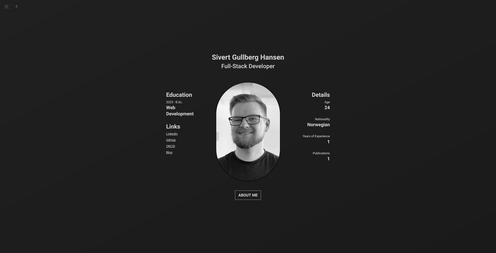

<div align=center>
<h1>Sivert.io</h1>

</div>

<br />
<br />

Built with:
- Nextjs
- Tailwind
- Framer-Motion
- DaisyUI
- Next-Themes
- Sass
- Typescript
- Eslint

<br />
<br />

## Installation

### Clone the project
```sh
git clone https://github.com/SivertGullbergHansen/Sivert.io.git portfolio
cd portfolio
```

### Install dependencies
```sh
npm i
```
or
```sh
yarn
```

### Run development server
```sh
npm run dev
```
or
```sh
yarn dev
```
